# Phase 3B — AutoML-Tuned Cost Model — Final Report

This phase upgrades the Phase 3A baseline pipeline with: (a) ~5× more data via parameterized TPC-H + curated TPC-DS, (b) plan-time log-transformed cost features and ratio features, (c) **Optuna**-driven hyperparameter tuning of all five tree models, (d) an **AutoML model selector** that picks the best model per regime by a composite of median q-error and plan-pick accuracy.

## AutoML winners

- **`plan_time`** → `lightgbm_tuned` (q-err median=1.39, RMSE=9867.0 ms, R²=+0.506, plan-pick acc=0.5075757575757576)
- **`post_mortem`** → `gradient_boosting_tuned` (q-err median=1.01, RMSE=5100.0 ms, R²=+0.875, plan-pick acc=0.9621212121212122)

## Leaderboard

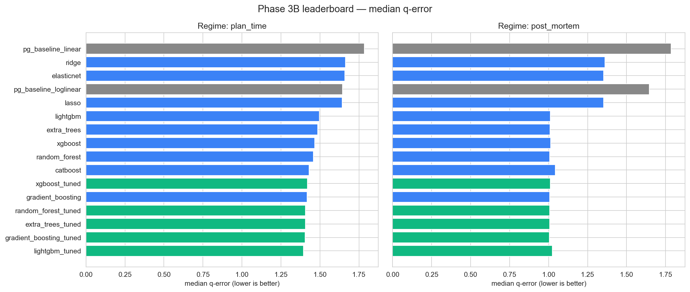

## Plan-pick accuracy

This is the metric that matters in production: for each query (group of 4 variants) does the model pick the truly fastest plan?

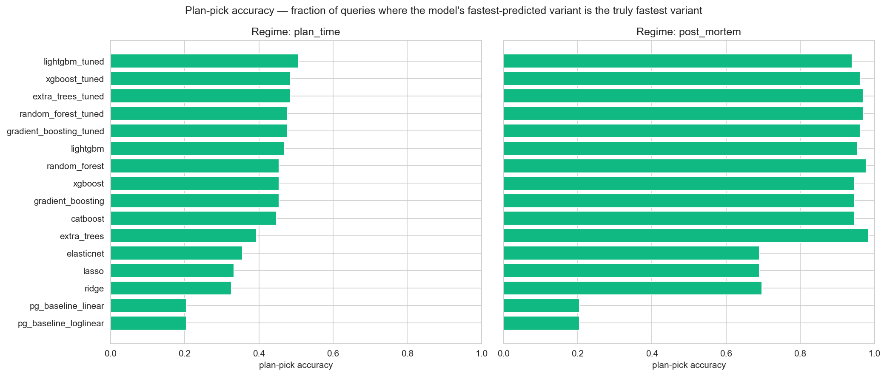

## Regret distribution (winners only)

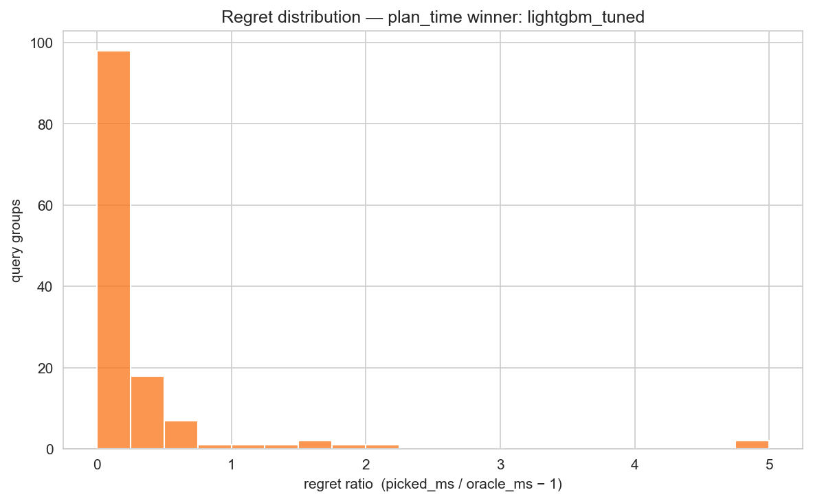

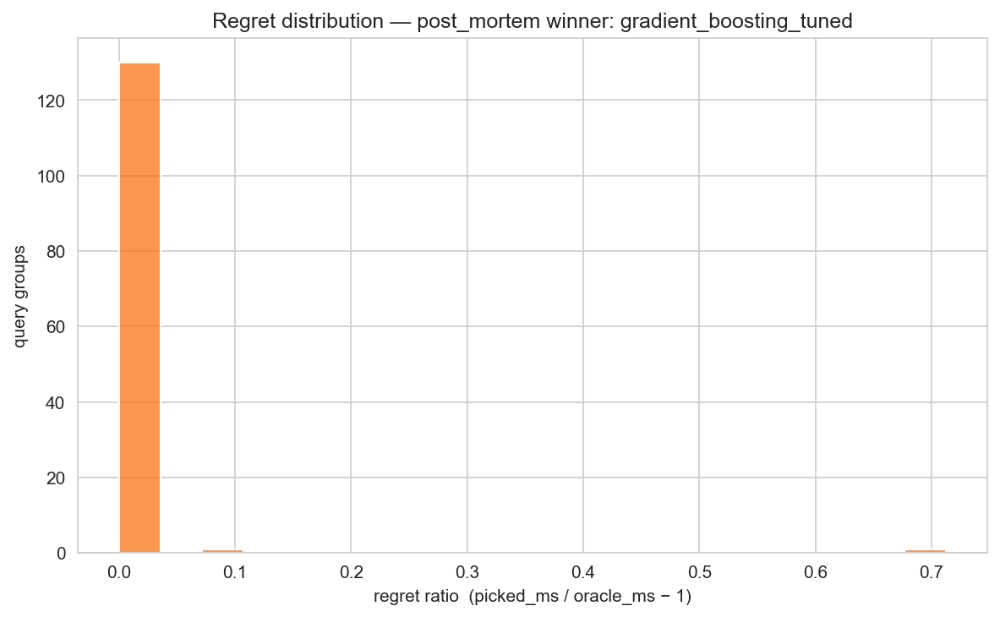

## Predicted vs Actual — AutoML winners

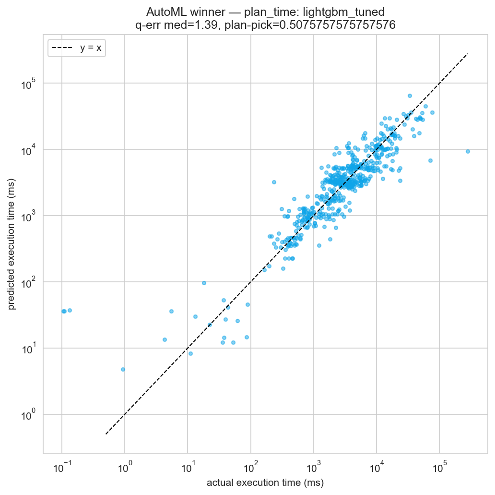

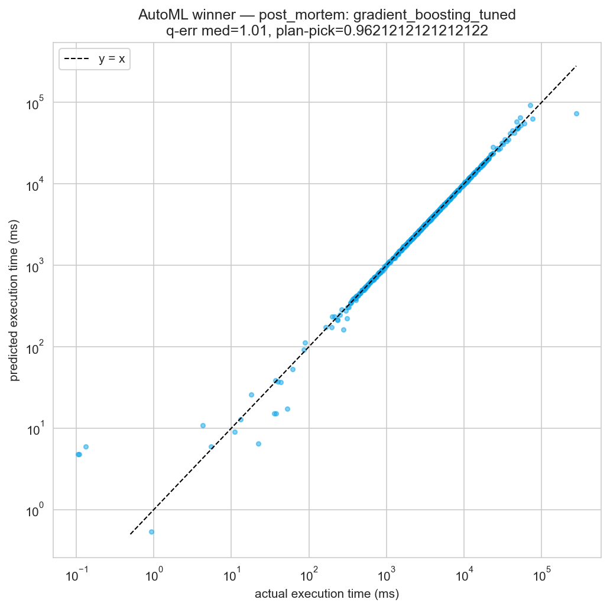

## Optuna convergence

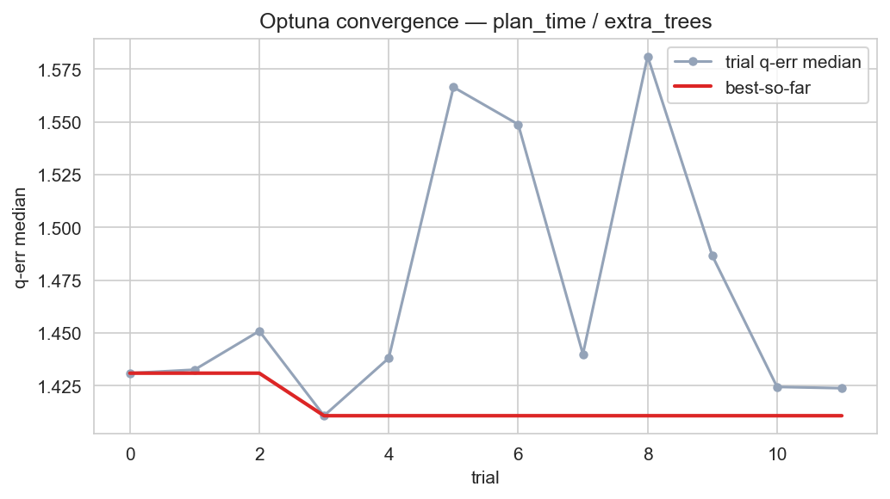

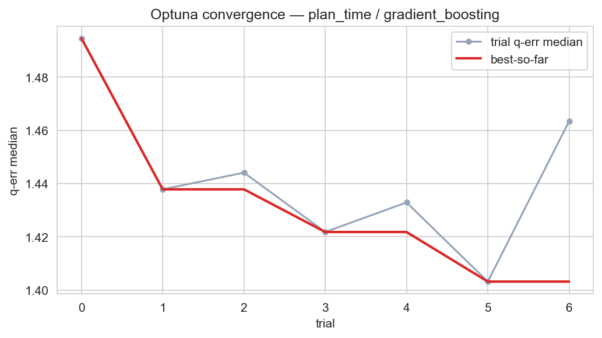

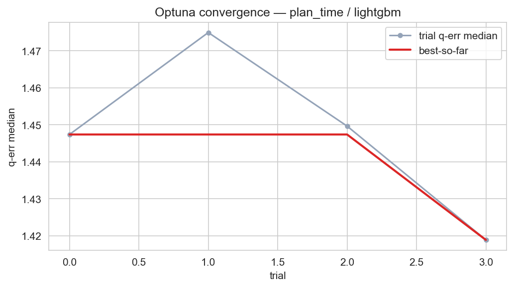

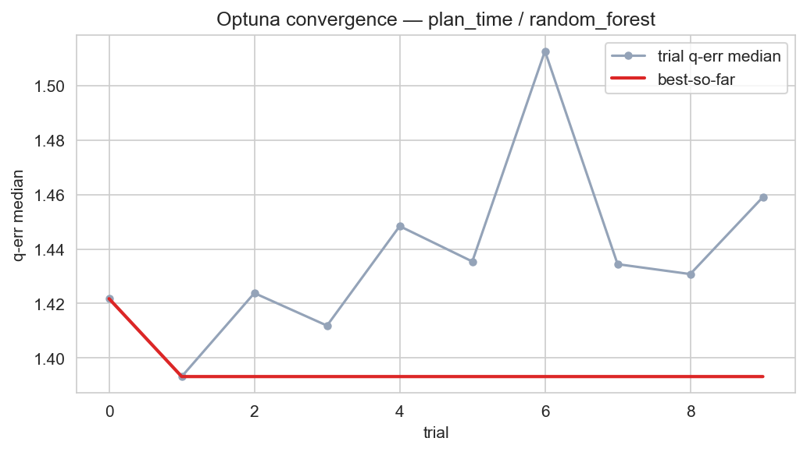

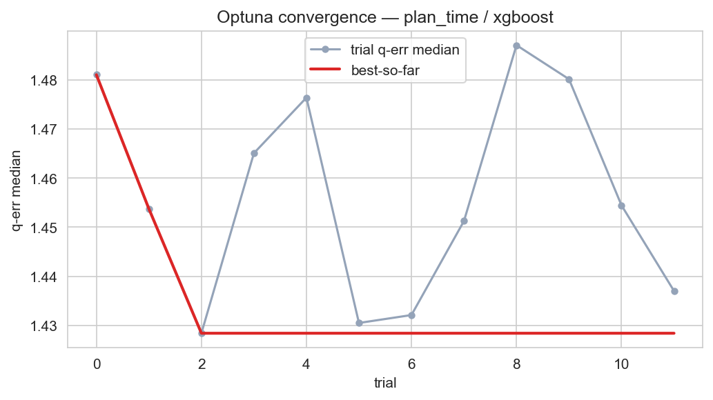

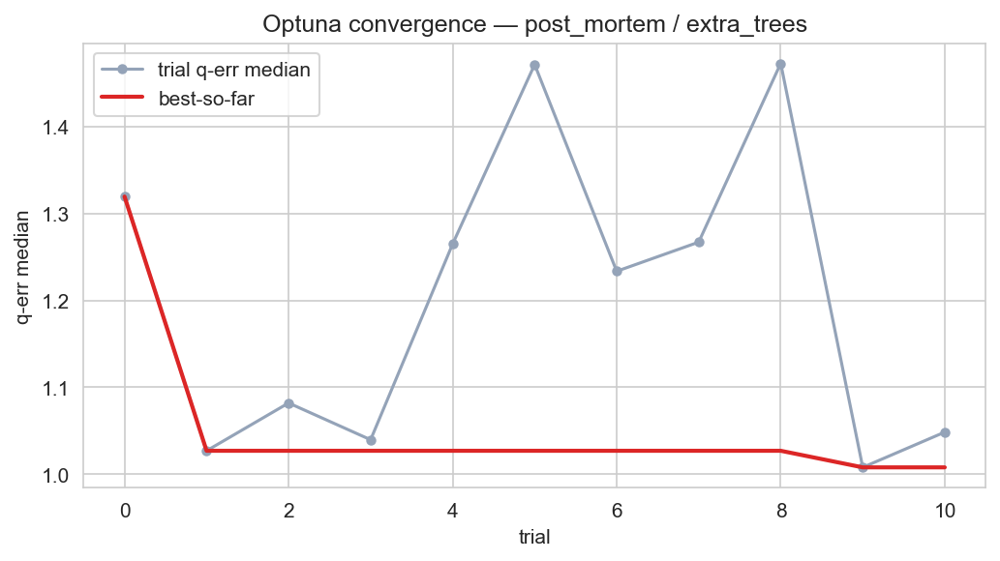

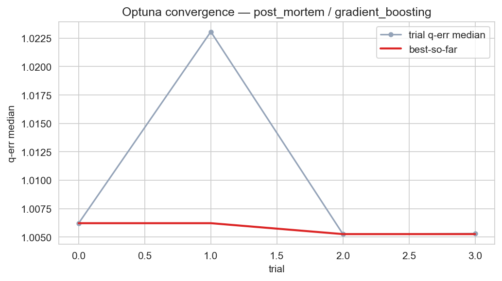

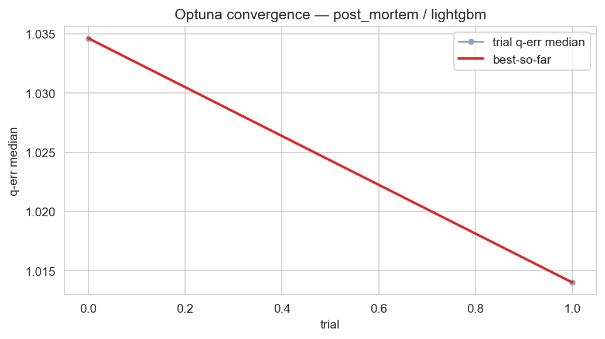

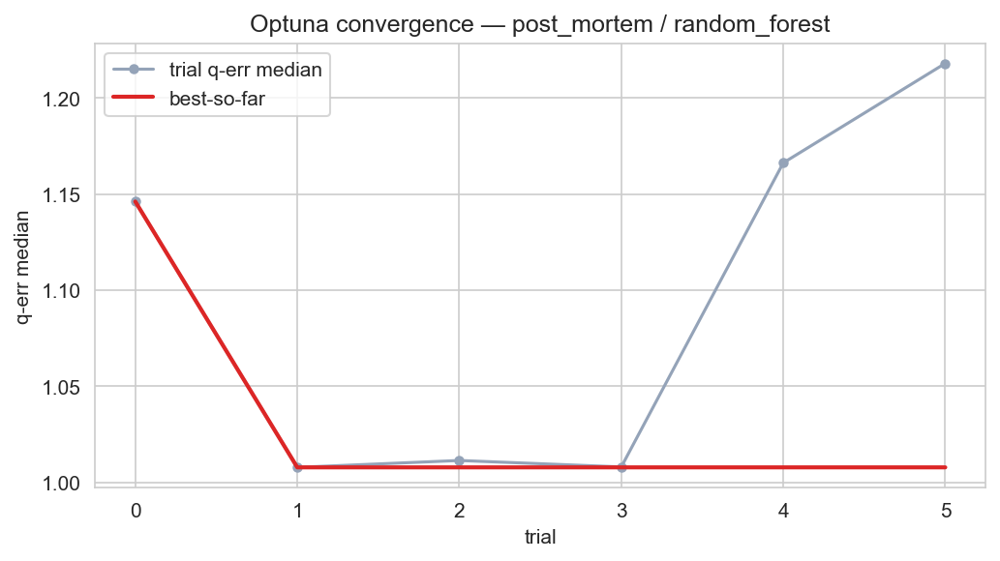

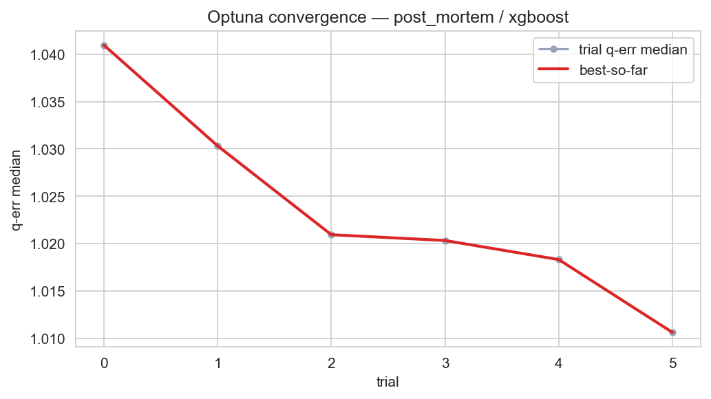

## Numeric leaderboard

### `plan_time`

| regime    | kind       | model                   |   q_error_median_mean |   q_error_p95_mean |   rmse_mean |   r2_mean |   plan_pick_acc |   regret_ms_mean |   train_seconds |
|:----------|:-----------|:------------------------|----------------------:|-------------------:|------------:|----------:|----------------:|-----------------:|----------------:|
| plan_time | tuned_ml   | lightgbm_tuned          |                 1.394 |              3.257 |     9867.03 |     0.506 |           0.508 |          586.62  |          23.226 |
| plan_time | tuned_ml   | gradient_boosting_tuned |                 1.406 |              3.322 |     9993.96 |     0.5   |           0.477 |         2752.64  |          10.891 |
| plan_time | tuned_ml   | extra_trees_tuned       |                 1.407 |              3.679 |     9605.9  |     0.533 |           0.485 |          412.247 |          51.742 |
| plan_time | tuned_ml   | random_forest_tuned     |                 1.408 |              3.609 |     9816.08 |     0.516 |           0.477 |         2650.49  |           6.473 |
| plan_time | default_ml | gradient_boosting       |                 1.418 |              3.717 |    10067.5  |     0.477 |           0.455 |          685.625 |          16.621 |
| plan_time | tuned_ml   | xgboost_tuned           |                 1.42  |              3.898 |     9865.55 |     0.505 |           0.485 |          629.745 |          13.703 |
| plan_time | default_ml | catboost                |                 1.43  |              3.378 |    10083.4  |     0.484 |           0.447 |         2794.92  |          29.684 |
| plan_time | default_ml | random_forest           |                 1.457 |              3.79  |     9941.2  |     0.501 |           0.455 |          745.897 |           6.497 |
| plan_time | default_ml | xgboost                 |                 1.466 |              3.741 |    10091.1  |     0.477 |           0.455 |          699.613 |          11.94  |
| plan_time | default_ml | extra_trees             |                 1.485 |              3.368 |     9988.87 |     0.488 |           0.394 |          686.555 |           9.392 |
| plan_time | default_ml | lightgbm                |                 1.496 |              3.733 |    10314.8  |     0.449 |           0.47  |          781.55  |          33.626 |
| plan_time | default_ml | lasso                   |                 1.643 |             29.175 |    65272.5  |  -180.501 |           0.333 |         3138.22  |           0.427 |
| plan_time | baseline   | pg_baseline_loglinear   |                 1.645 |              8.938 |    11561.2  |     0.055 |           0.205 |         4366.26  |           0.067 |
| plan_time | default_ml | elasticnet              |                 1.659 |             28.68  |    65236.5  |  -180.489 |           0.356 |         3067.45  |           0.462 |
| plan_time | default_ml | ridge                   |                 1.664 |             20.67  |    65096    |  -180.45  |           0.326 |         3217.67  |           0.11  |
| plan_time | baseline   | pg_baseline_linear      |                 1.786 |              8.346 |    10392.4  |     0.049 |           0.205 |         4366.26  |           0.106 |

### `post_mortem`

| regime      | kind       | model                   |   q_error_median_mean |   q_error_p95_mean |   rmse_mean |   r2_mean |   plan_pick_acc |   regret_ms_mean |   train_seconds |
|:------------|:-----------|:------------------------|----------------------:|-------------------:|------------:|----------:|----------------:|-----------------:|----------------:|
| post_mortem | tuned_ml   | gradient_boosting_tuned |                 1.005 |              1.104 |     5100.04 |     0.875 |           0.962 |            3.304 |          71.977 |
| post_mortem | default_ml | gradient_boosting       |                 1.008 |              1.103 |     4955.15 |     0.872 |           0.947 |            0.74  |          27.937 |
| post_mortem | default_ml | random_forest           |                 1.008 |              1.226 |     4974.43 |     0.875 |           0.977 |            0.166 |          54.253 |
| post_mortem | tuned_ml   | random_forest_tuned     |                 1.008 |              1.54  |     5431.73 |     0.858 |           0.97  |            0.157 |          80.067 |
| post_mortem | tuned_ml   | extra_trees_tuned       |                 1.008 |              1.238 |     5482.44 |     0.843 |           0.97  |            0.637 |          82.825 |
| post_mortem | default_ml | extra_trees             |                 1.008 |              1.234 |     5494.6  |     0.842 |           0.985 |            0.123 |          52.599 |
| post_mortem | tuned_ml   | xgboost_tuned           |                 1.011 |              1.178 |     5060.14 |     0.873 |           0.962 |            3.069 |          37.377 |
| post_mortem | default_ml | lightgbm                |                 1.011 |              1.156 |     5283.42 |     0.869 |           0.955 |           10.991 |         122.135 |
| post_mortem | default_ml | xgboost                 |                 1.013 |              1.215 |     4694.84 |     0.887 |           0.947 |            2.922 |          13.14  |
| post_mortem | tuned_ml   | lightgbm_tuned          |                 1.023 |              1.21  |     5463.99 |     0.862 |           0.939 |           11.642 |         135.591 |
| post_mortem | default_ml | catboost                |                 1.042 |              1.444 |     6164.64 |     0.822 |           0.947 |           13.3   |          74.329 |
| post_mortem | default_ml | lasso                   |                 1.353 |              3.828 |    66708.2  |   -20.436 |           0.689 |          335.716 |           5.343 |
| post_mortem | default_ml | elasticnet              |                 1.353 |              4.472 |    66791.5  |   -20.483 |           0.689 |          335.692 |           2.021 |
| post_mortem | default_ml | ridge                   |                 1.361 |              7.421 |    66506    |   -20.303 |           0.697 |          335.564 |           0.675 |
| post_mortem | baseline   | pg_baseline_loglinear   |                 1.645 |              8.938 |    11561.2  |     0.055 |           0.205 |         4366.26  |           1.005 |
| post_mortem | baseline   | pg_baseline_linear      |                 1.786 |              8.346 |    10392.4  |     0.049 |           0.205 |         4366.26  |           0.411 |
